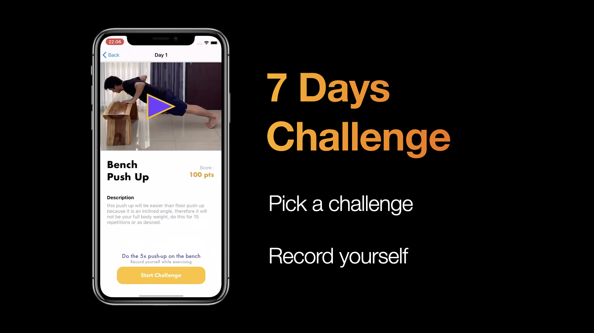
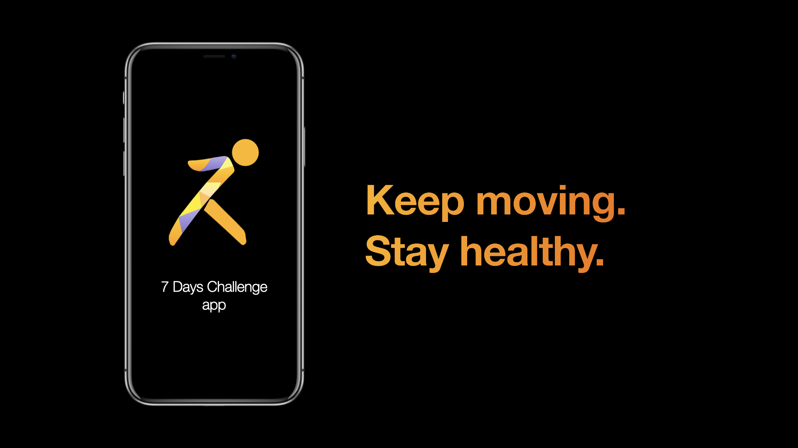

# 7Days-Challenge

iOS app project for Mini Challenge 1 in Apple Developer Academy GOP 🇮🇩

### Problem statement
>To improve our health during this WFH, we have to remind that we must stay active. Doing workout in our home will keep body fit, we can do it in a more fun way, with friends, with music, and using our things that we have in our house or room.

### Solution concept
*"A fun challenge app to exercise using common everyday object."*

